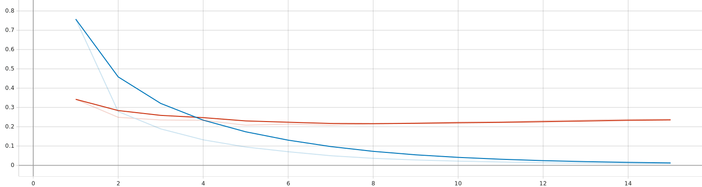
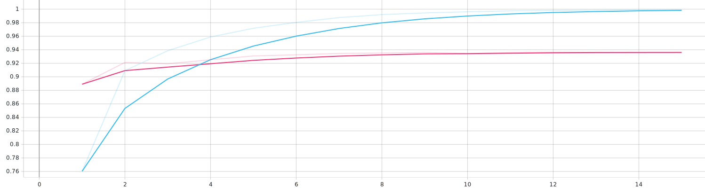

## 项目文件结构说明

- 配置文件：`configs/CIFAR10.yaml`
- CIFAR-10 数据集自行下载，放在 `data` 目录中（需要自行创建该目录）
- 训练日志目录：`logs`
- ResNet34 模型文件：`models/ResNet34.py`
- 训练模型保存目录：`save`（需要自行创建该目录）
- 训练函数文件：`util/trainer.py`

## 运行说明

- 运行 `train.py` 文件训练模型
- 使用命令 `tensorboard --logdir logs` 查看训练日志文件

## 训练结果

Loss（蓝线为训练 Loss，红线为验证 Loss）：

Accuracy（蓝线为训练 Accuracy，红线为验证 Accuracy）：

